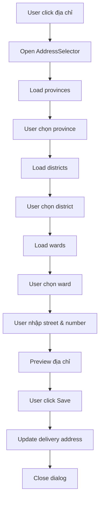

# 🏠 Tính năng Chọn Địa chỉ Giao hàng

## 📋 Tổng quan

Tính năng này cho phép người dùng chọn địa chỉ giao hàng theo cấp hành chính Việt Nam với bộ lọc từ Tỉnh/Thành phố → Quận/Huyện → Xã/Phường → Tên đường → Số nhà.

## 🚀 Cách sử dụng

### 1. Khởi động hệ thống

```bash
# Terminal 1: Khởi động Backend
cd server
npm install
npm run seed-address-data  # Seed dữ liệu địa chỉ
npm run dev

# Terminal 2: Khởi động Frontend User
cd user
npm install
npm start
```

### 2. Sử dụng tính năng

1. **Mở trang chủ**: Truy cập `http://localhost:3000`
2. **Chọn địa chỉ**: Click vào thanh "Giao đến" ở đầu trang
3. **Chọn theo cấp hành chính**:
   - Chọn **Tỉnh/Thành phố** (ví dụ: TP. Hồ Chí Minh)
   - Chọn **Quận/Huyện** (ví dụ: Quận 1)
   - Chọn **Xã/Phường** (ví dụ: Phường Bến Nghé)
   - Nhập **Tên đường** (ví dụ: Nguyễn Huệ)
   - Nhập **Số nhà** (ví dụ: 123)
4. **Lưu địa chỉ**: Click "Lưu địa chỉ"

## 🗄️ Cấu trúc Database

### Model Address
```javascript
{
  code: String,           // Mã địa chỉ
  name: String,           // Tên ngắn
  full_name: String,      // Tên đầy đủ
  level: Number,          // Cấp hành chính (1: Tỉnh, 2: Quận, 3: Xã)
  parent_code: String,    // Mã cấp cha
  is_active: Boolean      // Trạng thái hoạt động
}
```

### API Endpoints

- `GET /api/addresses/provinces` - Lấy danh sách tỉnh/thành phố
- `GET /api/addresses/districts/:provinceCode` - Lấy quận/huyện theo tỉnh
- `GET /api/addresses/wards/:districtCode` - Lấy xã/phường theo quận
- `GET /api/addresses/search?q=query` - Tìm kiếm địa chỉ

## 🎨 Giao diện

### Component AddressSelector
- **Dialog modal** với form chọn địa chỉ
- **Dropdown cascading** cho Tỉnh → Quận → Xã
- **Text fields** cho Tên đường và Số nhà
- **Preview** địa chỉ hoàn chỉnh
- **Validation** đảm bảo chọn đầy đủ thông tin

### Component DeliveryAddressBar
- **Thanh hiển thị** địa chỉ hiện tại
- **Button click** để mở AddressSelector
- **Responsive design** cho mobile

## 🔧 Cài đặt và Cấu hình

### 1. Backend Setup

```bash
# Tạo model Address
server/src/models/Address.js

# Tạo API routes
server/src/routes/addresses.js

# Thêm route vào server
server/src/index.js

# Seed dữ liệu mẫu
npm run seed-address-data
```

### 2. Frontend Setup

```bash
# Tạo component AddressSelector
user/src/components/home/AddressSelector.tsx

# Cập nhật DeliveryAddressBar
user/src/components/home/DeliveryAddressBar.tsx

# Thêm API service
user/src/services/api.ts
```

## 📊 Dữ liệu mẫu

### Tỉnh/Thành phố
- Hà Nội (01)
- TP. Hồ Chí Minh (79)
- Đà Nẵng (48)
- Cần Thơ (92)
- Bạc Liêu (95)

### Quận/Huyện
- Hà Nội: Ba Đình, Hoàn Kiếm, Hai Bà Trưng, Đống Đa, Tây Hồ
- TP.HCM: Quận 1, Quận 2, Quận 3, Quận 4, Quận 5

### Xã/Phường
- Ba Đình: Phúc Xá, Trúc Bạch, Vĩnh Phúc, Cống Vị, Liễu Giai
- Quận 1: Bến Nghé, Bến Thành, Đa Kao, Nguyễn Thái Bình, Phạm Ngũ Lão

## 🎯 Tính năng nâng cao

### 1. Tìm kiếm địa chỉ
- Tìm kiếm theo tên địa chỉ
- Gợi ý địa chỉ khi nhập
- Lọc kết quả theo cấp hành chính

### 2. Validation
- Kiểm tra đầy đủ thông tin bắt buộc
- Validate định dạng địa chỉ
- Hiển thị thông báo lỗi

### 3. UX/UI
- Loading states cho từng cấp
- Error handling
- Responsive design
- Keyboard navigation

## 🔄 Workflow



## 🐛 Troubleshooting

### Lỗi thường gặp

1. **Không load được dữ liệu địa chỉ**
   - Kiểm tra MongoDB connection
   - Chạy lại `npm run seed-address-data`

2. **API không response**
   - Kiểm tra server đã start chưa
   - Kiểm tra CORS configuration

3. **Component không render**
   - Kiểm tra import/export
   - Kiểm tra TypeScript errors

### Debug

```bash
# Backend logs
cd server && npm run dev

# Frontend logs
cd user && npm start

# Database check
mongo sales_management
db.addresses.find().limit(5)
```

## 📈 Roadmap

### Phase 1 ✅ (Hoàn thành)
- [x] Model Address và API
- [x] Component AddressSelector
- [x] Integration với Home page
- [x] Basic validation

### Phase 2 🔄 (Đang phát triển)
- [ ] Google Maps integration
- [ ] Auto-complete địa chỉ
- [ ] Lưu địa chỉ yêu thích
- [ ] Địa chỉ mặc định

### Phase 3 📋 (Kế hoạch)
- [ ] Multi-language support
- [ ] Address verification
- [ ] Delivery time estimation
- [ ] Address history

## 🤝 Contributing

1. Fork repository
2. Tạo feature branch
3. Commit changes
4. Push to branch
5. Tạo Pull Request

## 📝 License

MIT License - Xem file LICENSE để biết thêm chi tiết. 